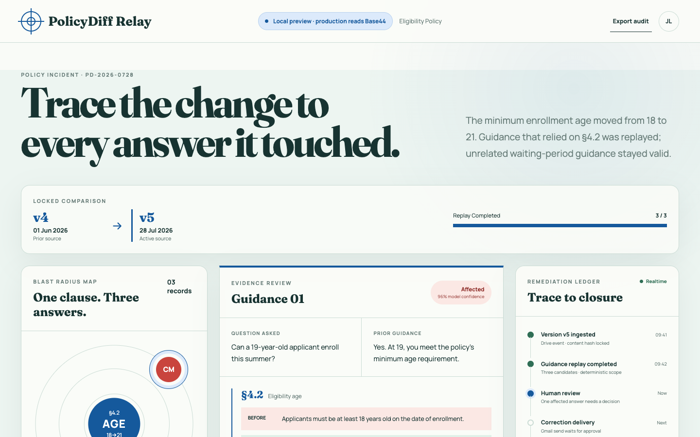
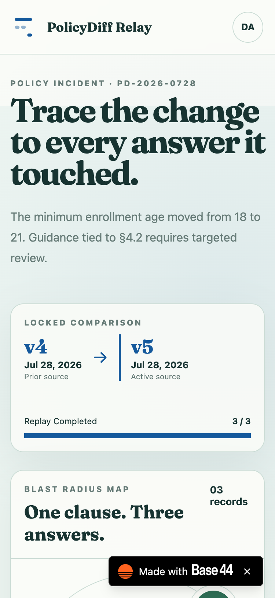

# PolicyDiff Relay: Policy change incident response for prior guidance

PolicyDiff Relay finds answers made unsafe by a policy update, routes each
finding to a human reviewer, and tracks the correction until the recipient
acknowledges it.

[](https://www.typescriptlang.org/)
[](https://react.dev/)
[](https://base44.com/)
[](#testing)
[](LICENSE)



## Contents

- [What PolicyDiff Relay does](#what-policydiff-relay-does)
- [Live demo](#live-demo)
- [Demo journey](#demo-journey)
- [Features](#features)
- [Screenshots](#screenshots)
- [Technology](#technology)
- [Architecture](#architecture)
- [Security model](#security-model)
- [Running locally](#running-locally)
- [Base44 setup](#base44-setup)
- [Testing](#testing)
- [Project structure](#project-structure)
- [Known limitations](#known-limitations)
- [License](#license)

## What PolicyDiff Relay does

A source document can change after staff have already answered questions from
it. The document has a new version, but the old answers still exist in email,
tickets, or case notes.

PolicyDiff Relay records each answer against an exact policy version and its
cited clauses. When the allowlisted Google Doc changes, the app exports the new
content, stores a deduplicated version, compares clauses, and replays only the
guidance that might depend on the change. The model proposes structured
findings. A person approves any correction.

The current MVP uses one Google Doc, one shared Gmail sender, one organization,
and fictional recipient data.

## Live demo

[Open PolicyDiff Relay on Base44](https://policydiff-relay-8292a74a.base44.app).
Sign in with an assigned reviewer or policy-admin account to open the control
room.

## Demo journey

The judge-facing flow fits into about 90 seconds:

1. Sign in as the policy reviewer.
2. Open the Eligibility Policy comparison from v4 to v5.
3. Select the red affected node in the blast-radius map.
4. Read the prior answer, changed clause, rationale, and correction draft.
5. Approve the correction. The backend revalidates the finding and creates a
   locked delivery.
6. Send the correction through the connected Gmail account.
7. Open the recipient link and acknowledge receipt.
8. Watch the remediation ledger update through Base44 realtime.
9. Ask Policy Ops why the uncertain finding is blocked.
10. Export the private audit packet.

The green finding remains valid because its cited clause did not change. The
amber finding stays uncertain because the policy does not define the worker
classification needed to decide it.

## Features

- Immutable policy versions keyed by source file and content hash
- Clause-level normalization and material change candidates
- Deterministic replay filters before model inference
- Affected, still-valid, and uncertain review states with cited evidence
- Reviewer-owned approval and server-side correction revalidation
- A sending lease that prevents duplicate Gmail delivery
- Hashed, expiring, single-use acknowledgement tokens
- Realtime finding, approval, delivery, task, and acknowledgement updates
- A restricted staff agent that can explain findings or open reviewer tasks
- Private audit files exposed through five-minute signed URLs

## Screenshots

| Desktop control room | Mobile review |
|---|---|
|  |  |

The interface uses the selected Evidence Cartography direction. The changed
clause sits at the center of the orbit. Prior answers appear around it by
classification, while the evidence panel and remediation ledger preserve the
review trail.

## Technology

| Layer | Technology |
|---|---|
| Frontend | React 19, TypeScript, Vite |
| Backend | Base44 Deno functions |
| Data and access | Base44 entities, RLS, and field-level rules |
| Identity | Base44 Auth with User extensions |
| Source connector | Base44 shared Google Drive connector |
| Delivery connector | Base44 shared Gmail connector |
| Model calls | Base44 `InvokeLLM` structured output |
| Realtime | Base44 entity subscriptions |
| Agent | Base44 `policy_ops` agent with two allowlisted tools |
| Audit storage | Base44 private files and signed URLs |
| Hosting | Base44 site hosting |
| Tests | Node test runner and strict TypeScript |

## Architecture

```text
Google Doc file.update
        |
        v
ingestPolicyVersion
  export -> canonicalize -> hash -> deduplicate
        |
        v
extractPolicyClauses -> comparePolicyVersions
        |
        v
policy admin activates version
        |
        v
createReplayJob -> deterministic filters -> replayGuidance
        |
        v
Finding: affected | still_valid | uncertain
        |
        v
human approval -> locked Delivery -> shared Gmail
        |
        v
single-use acknowledgement -> realtime remediation ledger
        |
        +----> private audit packet
        |
        +----> restricted Policy Ops agent
```

Base44 is the system of record and the execution boundary. The browser can
read records allowed by RLS and invoke named functions. It cannot directly
approve findings, create deliveries, send mail, acknowledge a token, or create
an audit packet.

### Data graph

```text
Organization
  +-- User
  +-- Policy
      +-- PolicyVersion
          +-- PolicyClause
          +-- PolicyDelta
          +-- ReplayJob
              +-- ReplayItem
                  +-- Finding
                      +-- ReviewTask
                      +-- Approval
                          +-- Delivery
                              +-- DeliverySecret
                              +-- Acknowledgement
  +-- Guidance
  +-- AuditPacket
  +-- OperationEvent
```

### Trusted functions

| Function | Responsibility |
|---|---|
| `seedDemoWorkspace` | Provision one idempotent v4 baseline and three fictional cited answers |
| `seedDemoIncident` | Build the deterministic v5 incident when connector automation is unavailable |
| `loadControlRoomData` | Return the role-filtered control-room record set |
| `ingestPolicyVersion` | Accept the Drive event, export the allowlisted Doc, and deduplicate content |
| `extractPolicyClauses` | Produce schema-validated clauses and persist their evidence |
| `comparePolicyVersions` | Build one explicit old/new version delta |
| `activatePolicyVersion` | Move the policy pointer and start replay |
| `createReplayJob` | Create a durable replay job |
| `replayGuidance` | Apply deterministic scope and store structured candidate findings |
| `createGuidance` | Record an answer against the active version and valid citations |
| `approveFinding` | Enforce reviewer role, claim the finding, and queue one delivery |
| `sendCorrection` | Revalidate the aggregate, claim the send, and call Gmail once |
| `reconcileDeliveries` | Process due work and quarantine ambiguous send leases |
| `acknowledgeDelivery` | Verify the token and record acknowledgement once |
| `createAuditPacket` | Write the organization trail to a private file |
| `explainFinding` | Return a redacted, evidence-bound explanation |
| `createReviewerTask` | Open one deduplicated human task |

## Security model

Every workflow entity carries `organization_id`. RLS compares it with the
authenticated user's organization, then checks the user's policy role.
Trusted workflow records deny direct client creation, update, and deletion.

Field-level rules hide:

- policy version source text
- recipient names and email addresses
- Gmail message identifiers
- acknowledgement fingerprints and token hashes
- connector details and private file URIs

The UI shows fictional guidance labels instead of recipient identity. The send
function reads the recipient through its service role only after it reloads the
approved delivery aggregate.

### Delivery safety

The delivery idempotency key binds approval, guidance, and correction revision.
A compare-and-set transition claims `queued` or `retry_wait` as `sending`.
Concurrent callers cannot both own that claim. An ambiguous network result
stays claimed for reconciliation instead of triggering a blind resend.

### Acknowledgement safety

The public token is derived with a server secret. Only its hash is stored.
Tokens expire, can be used once, and are bound to one delivery. Replay attempts
are rejected.

## Running locally

### Prerequisites

- Node.js 22 or newer
- npm
- A Base44 account for authenticated backend work
- Google Workspace access for the connector flow

### Install and start

```bash
npm install
npm run dev
```

Open [http://localhost:5173](http://localhost:5173).

Local development falls back to a clearly labeled fictional snapshot when no
Base44 session is available. Production builds never use that fixture.

### Available commands

| Command | Purpose |
|---|---|
| `npm run dev` | Start the Vite development server |
| `npm run build` | Create the production site in `dist/` |
| `npm run package:base44` | Bundle isolated Base44 function deploy artifacts |
| `npm run deploy:base44` | Package and deploy the linked Base44 app |
| `npm run preview` | Serve the production build locally |
| `npm test` | Run unit, integration, authorization, and contract tests |
| `npm run typecheck` | Check backend and frontend TypeScript projects |
| `npx base44 types generate` | Regenerate entity and function names for the SDK |

## Base44 setup

### 1. Authenticate and link an app

```bash
npx base44 login
npx base44 link
npx base44 types generate
```

`base44/.app.jsonc` contains the local app link and is ignored by Git.

### 2. Configure authentication

The repository enables Base44 username and password login. User records need
these extensions:

```text
organization_id
policy_role: policy_admin | reviewer | auditor | staff
```

The fields are client read-only. Assign them through an administrative setup
path, not through `auth.updateMe`.

### 3. Authorize connectors

Google Drive needs read-only access. Gmail needs send-only access.

```bash
npx base44 connectors initiate \
  --integration-type googledrive \
  --scopes https://www.googleapis.com/auth/drive.readonly

npx base44 connectors initiate \
  --integration-type gmail \
  --scopes https://www.googleapis.com/auth/gmail.send
```

Set the Drive automation's `resource_id` to the exact Google Doc file ID before
activating it. Keep `allowlisted_policy_file_update` inactive until that ID is
confirmed.

### 4. Provision the fictional baseline

After deploying the backend resources, sign in as the policy admin and run:

```bash
printf '%s\n' \
  'console.log(await base44.functions.invoke("seedDemoWorkspace", { source_file_id: "YOUR_GOOGLE_DOC_FILE_ID", recipient_email: "YOUR_DEMO_INBOX" }))' \
  | npx base44 exec
```

The function is safe to repeat. It creates or reuses one v4 policy version,
three clauses, and three fictional guidance records. Only the affected record
uses the supplied demo inbox. The real Drive event still creates v5 and starts
the comparison pipeline.

Paste [`demo/eligibility-policy-v4.txt`](demo/eligibility-policy-v4.txt) into
the shared Google Doc before setup. Change it to
[`demo/eligibility-policy-v5.txt`](demo/eligibility-policy-v5.txt) to trigger
the incident.

### 5. Set server secrets

```bash
npx base44 secrets set \
  ACKNOWLEDGEMENT_SECRET="$(openssl rand -hex 32)" \
  PUBLIC_APP_URL="https://your-base44-site.example"
```

These values belong in Base44 secrets. Do not add them to a client environment
file.

### 6. Create dashboard Workflows

Create the seven dashboard Workflows, including the Drive `file.update`
Workflow, from
[`base44/workflows/setup-prompt.md`](base44/workflows/setup-prompt.md). Keep
them inactive until the functions, secrets, and connector authorizations are
ready.

### 7. Validate before deployment

```bash
npm test
npm run typecheck
npm run build
npm run package:base44
npx base44 types generate
```

Deploying resources or the site changes the linked Base44 app. Follow the
project's approval process before running:

```bash
npm run deploy:base44
```

## Testing

The suite has 101 passing tests across 25 files.

```bash
npm test
```

Coverage includes:

- entity RLS and field-level rules
- authenticated role checks
- Drive allowlisting and content deduplication
- clause and replay output contracts
- explicit version binding
- human approval
- stale aggregate rejection
- concurrent delivery claims
- ambiguous Gmail outcomes
- reconciliation
- token expiry and replay rejection
- restricted agent tools
- private audit export
- frontend Base44 and realtime boundaries
- review and delivery UI state transitions

See [Phase 4 hardening evidence](reports/phase-4-hardening.md) for the risk
matrix and the test file associated with each case.

## Project structure

```text
.
├── base44/
│   ├── agents/             # Restricted Policy Ops agent
│   ├── auth/               # Base44 authentication settings
│   ├── connectors/         # Drive and Gmail scope declarations
│   ├── entities/           # Schemas, RLS, and field-level rules
│   ├── functions/          # Trusted workflow transitions
│   └── shared/             # Hashing, policy, delivery, and workflow logic
├── demo/                   # Fictional policy source and 90-second runbook
├── docs/images/            # Verified desktop and mobile screenshots
├── reports/                # Architecture, data model, gaps, and hardening notes
├── src/
│   ├── api/                # Base44 client and control-room gateway
│   ├── components/         # Evidence Cartography interface
│   ├── data/               # Development-only fictional snapshot
│   ├── domain/             # Pure frontend workflow decisions
│   ├── hooks/              # Data loading, actions, and realtime subscriptions
│   └── types/              # Control-room view types
├── tests/
    ├── integration/        # Authorization and hosted-boundary tests
    └── unit/               # Policy, delivery, ingestion, and UI logic tests
└── video/                  # Demo script, live captures, renderer, and exports
```

## Known limitations

- Google Drive and Gmail require an authorized shared connection in each
  deployed workspace.
- The Drive Workflow must stay bound to the exact allowlisted Google Doc.
- Audit download links expire after five minutes.
- The MVP covers one source document, one sender, and one organization.
- The model proposes review candidates. It does not make policy decisions.
- The current evidence alias is a guidance label, not recipient identity.

Two Base44 documentation gaps found during implementation are recorded in
`reports/`. The workarounds keep entity automations out of the critical path
and unwrap the documented connector payload explicitly.

## License

[MIT](LICENSE)
